# Data Scientist Nanodegree

## **Human Resources Analytics - Capstone Project**

Dalal Alwedaah
August 28th, 2019

## **I. Definition**

### **Project Overview**

Recently machine learning have been used in human resource. It used in different set of task for example for screening candidates, anticipating turn-over or even to help deciding when to promote an employee[1].

One of the key issue of organizations is employees turnover because it effect on its productivity and long term strategy. One way to solve this problem is by predicting and human resource department can take proactive action to handle it[2]. This project is aimed to predict if employee will leave or not.

This is a case of binary classification problem which is part of supervised learning problem. Employee turnover is the target variable while employee data are the features.

### **Problem Statement**

Employee turnover is costly for companies. In this project, we predict which valuable employees will leave next based on various parameters. Then, companies can keep them by give them some offers or solve their job related issues.

### **Metrics**

The data set is unbalanced and the accuracy is not a good choice to measure the algorithm performance. Rather of accuracy AUC (Area Under the ROC Curve)[4] will be used. ROC curve (receiver operating characteristic curve) is a graph showing the performance of a classification model at all classification thresholds.

 
Figure 1 AUC (Area under the ROC Curve)

This curve plots two parameters:

- True Positive Rate (TRP) is defined as follows:

TRP = TP/TP+FN

- False Positive Rate (FPR) is defined as follows:

FPR = FP/FP+TN

## **II. Analysis**

### **Data Exploration**

The dataset has 9 features and 1 target variable described as following:

Table 1 dataset variables

|   | Name | Description | Value/unit |
| --- | --- | --- | --- |
| Features | satisfaction\_level | Employee satisfaction level | scaling 0 to 1 |
| last\_evaluation | Last evaluation | scaling 0 to 1 |
| number\_project | Number of projects | projects |
| average\_montly\_hours | Average monthly hours | hours |
| time\_spend\_company | Time spent at the company in years | years |
| Work\_accident | Whether they have had a work accident | 0 or 1 |
| promotion\_last\_5years | Whether they have had a promotion in the last 5 years | 0 or 1 |
| Sales | Department the employee works for | Sales, accounting, hr, technical, support, management, IT, product\_mng, marketing, RandD |
| Salary | Salary level | low, medium or high  |
| Target | **left** | **Whether the employee has left** | 0 or 1 |

Out of these features, there are 7 numerical variable, 1 categorical variable, and 1 ordinal variable. All non-numerical variable will be transformed to numerical ones. The total number of instances is 14,998 where 85% of them will used for model training and 15% of them will used for testing. All data is completed do not contain null values.

Some descriptive statistic of the dataset are presented in the table below:

Table 2 descriptive statistic

|   | COUNT | MEAN | STD | MIN | 0.25 | 0.5 | 0.75 | MAX |
| --- | --- | --- | --- | --- | --- | --- | --- | --- |
| satisfaction\_level | 14999 | 0.612834 | 0.248631 | 0.09 | 0.44 | 0.64 | 0.82 | 1 |
| last\_evaluation | 14999 | 0.716102 | 0.171169 | 0.36 | 0.56 | 0.72 | 0.87 | 1 |
| number\_project | 14999 | 3.803054 | 1.232592 | 2 | 3 | 4 | 5 | 7 |
| average\_montly\_hours | 14999 | 201.0503 | 49.9431 | 96 | 156 | 200 | 245 | 310 |
| time\_spend\_company | 14999 | 3.498233 | 1.460136 | 2 | 3 | 3 | 4 | 10 |
| Work\_accident | 14999 | 0.14461 | 0.351719 | 0 | 0 | 0 | 0 | 1 |
| left | 14999 | 0.238083 | 0.425924 | 0 | 0 | 0 | 0 | 1 |
| promotion\_last\_5years | 14999 | 0.021268 | 0.144281 | 0 | 0 | 0 | 0 | 1 |
| salary | 14999 | 1.594706 | 0.637183 | 1 | 1 | 2 | 2 | 3 |

  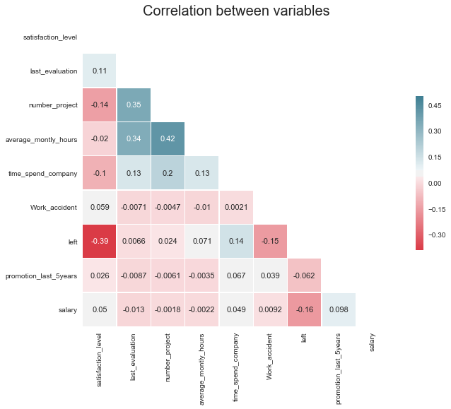
Figure 2 correlation between variables

There are some degree of correlation between satisfaction level and left variable. It has computed by person coefficient which is -.39.

### **Exploratory Visualization**

these histograms shows features distributions. Features do have outlier value.

 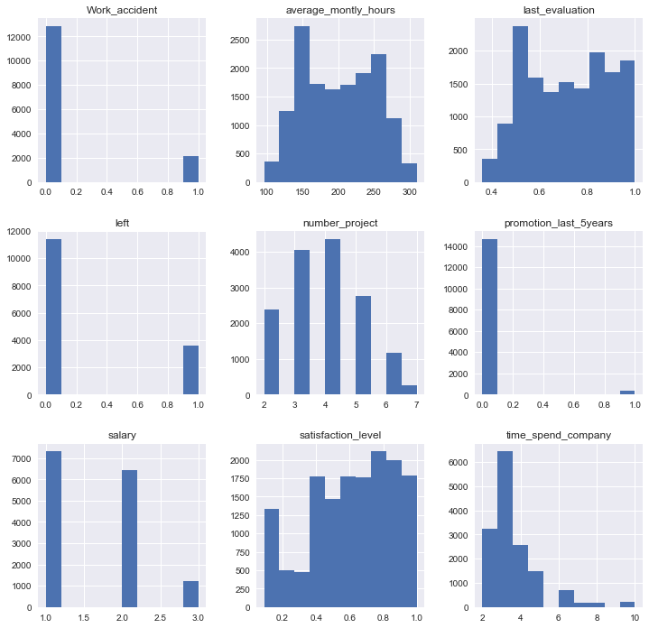
Figure 3 Features histogram

There are 76% of the employees stayed and 24% left.

  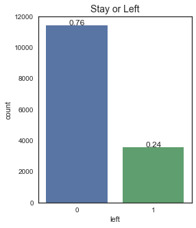
Figure 4 turnover rate

The department that have highest turnover rate are HR, accounting and technical.

  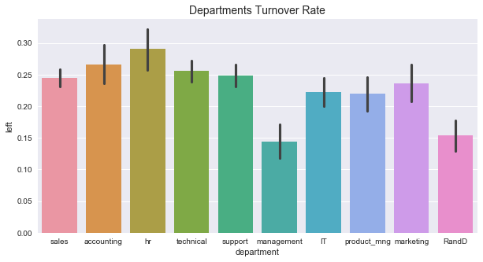
Figure 5 Department turnover rate

The employee work more than 6 years in the company are more likely to stay.

  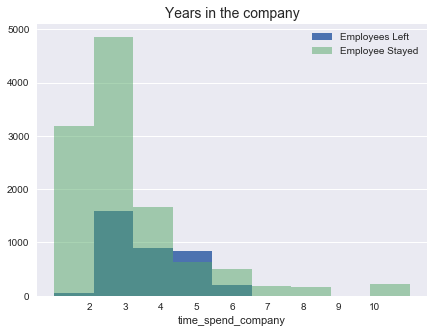
Figure 6 turnover based on Years in the company

There are two groups they left the company below and above the average performance.

  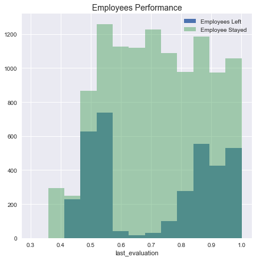
Figure 7 turnover based on employees performance

There are two groups they left the company work below and above the average work hours.

  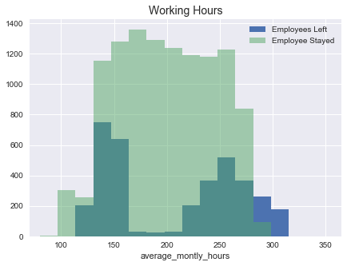
Figure 8 turnover based on working hours

### **Algorithms and Techniques**

I will try the following algorithms for classifications:

One of the most basic classification algorithm is linear regression, if linear regression can classify the data will then, there is no need for further complexity.

The next algorithms are tree based classification models with ensemble method: Random forest and gradient boost . Random forest classifier is Robust to outliers and scalable. It build multiple classifiers from same training data and then take the mean , median or mod of the output (bagging approach). Gradient boost is works on gradually decreasing the error for each tree. it provides better accuracy with smaller number of trees. Also, it handle data of mixed type. it build each tree from previse tree and use weighted average of these weak learner(boosting approach).

### **Benchmark**

The author of this paper[2] used 7 models in his research which are listed below:

1. Logistic Regression
2. Naïve Bayesian
3. Random Forest
4. K-Nearest Neighbor (KNN)
5. Linear Discriminant Analysis (LDA)
6. Support Vector Machine (SVM)
7. Extreme Gradient Boosting (XGBoost)

Out of these 7 models, XGBoost was able to explain 88% of the variance in the training data and **86%** in test data according the AUC score.

## **III. Methodology**

### **Data Preprocessing**

We do some necessary changes on variables :

1. Change variable names to more appropriate names(change the variable name from **sale** to **department** ).
2. Convert **department** and **salary** variable to categorical variables.

  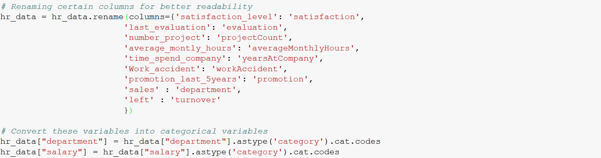
Figure 9 preprocessing code

### **Implementation**

The model implementation is done in following steps:

1. Split the data for  training and testing to avoid overfitting
2. Excuse each classifier and record the scores
3. Plot the result into ROC graph

List of algorithms have been used:

1. ensemble.RandomForestClassifier
2. linear\_model.LogisticRegression
3. ensemble.GradientBoostingClassifier

performance matrices has been used:

- Area Under ROC curve(AUC) calculated using **roc\_auc\_score ()** function (main measurement)
- Confusion matrix calculated using **classification\_report()** function (extra for more understanding)

**Result**

Table 3 models performance results

|   | AUC Training | AUC Testing | Training Time |
| --- | --- | --- | --- |
| Logistic Regression | 0.78 | 0.77 | 0.05 |
| Random Forest | 0.96 | 0.96 | 5.01  |
| Gradient Boosting | 0.98 | 0.96 | 1.94 |

As observed from the result, **RandomForestClassifier** and **LogisticRegression** perform better than other classification models int erm of AUC. In training time, logistic regression is take less than other models.

### **Refinement**

For refining the model. I tweaked the following parameters of **RandomForestClassifier** :

- n\_estimators = number of trees in the foreset
- max\_features = max number of features considered for splitting a node
- max\_depth = max number of levels in each decision tree
- min\_samples\_split = min number of data points placed in a node before the node is split
- min\_samples\_leaf = min number of data points allowed in a leaf node
- bootstrap = method for sampling data points (with or without replacement)

My features superset as following:

  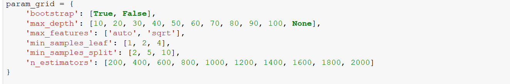 
Figure 10 features superset

Before tuning AUC score was 0.98. After tuning it rose to 0.99, a performance is grow little bit maybe the first parameter picked was good enough for this dataset.

There are some challenged faced overcome during this step. There are many different models can be used. There are many hyperparameter to be tuned. Choosing to use cross validation and cv search on all algorithm or the best. Overfitting is big challenge in tree based model. Splitting percentage for training and testing.

## **IV. Results**

### **Model Evaluation and Validation**

Features of the untuned model:

- n\_estimators=1000,
- **max\_depth=6,**
- min\_samples\_split=2,
- class\_weight=&quot;balanced&quot;

Features of best model after hyper parameter tuning:

- n\_estimators=1600,
- **max\_depth=**** 90,**
- min\_samples\_split=5,
- min\_samples\_leaf= 1

**Robustness check:**

AUC score on test data = 0.99. R2 score of untuned model = 0.96. Difference = 0.5 or 5%.

Therefore, we can see that even though the high values of tuned parameter , the raise in performance on test data is disturbing me because it a signal for the model start overfitted. The tuned model seemed to overfitted then I preferred to use the model before tuning as final model.

### **Justification**

Table 4 final vs. benchmark model

| Parameter | Final Model | Benchmark model | difference |
| --- | --- | --- | --- |
| Training AUC score | 96% | 88% | 8% |
| **Testing AUC score** | **96%** | **86%** | **10%** |

  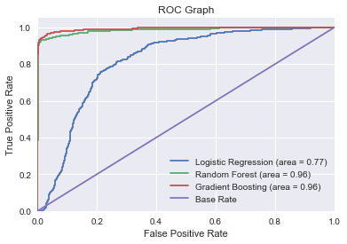
Figure 11 ROC graph result

Based on measurement recorded above, the final untuned model can be considered as satisfying solution.

## **V. Conclusion**

### **Free-Form Visualization**

 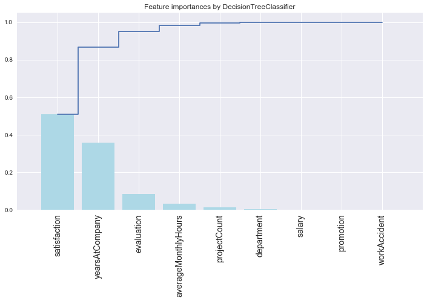
Figure 12 features importance

Top 3 Features:

1. Satisfaction
2. Years at Company
3. Evaluation

As we see in analysis part, the factor that related to the turnover and effecting it the most is if employee satisfying or not and the how many years employee spend in it.

### **Reflection**

This project can be summarized as the sequence of following steps:

1. Searching for a problem by looking at datasets on UCI Machine Learning repository and Kaggle and deciding between Classification and Regression problems.

2. Visualizing various aspects of dataset.

3. Preprocessing the data.

4. Deciding the algorithms to be used to solve the problem.

5. Creating a benchmark model.

6. Applying selected algorithms and visualizing the results.

7. Hyper parameter tuning for the best algorithm and reporting the test score of best model. 8. Discuss importance of selected features and check the robustness of model.

Out of this, I found steps 1, 2 very interesting. Deciding between HR and Media problem is important obstacle. I decide to choose HR even there are less option on it to support my next job. The dataset is interesting and it perfectly fit for analyzing lesson.

Therefore, choosing the best algorithm and the best measure and avoid overfitting was particularly challenging. The real challenge is that I running of time and I must complete the project in two days to be graduated.

the final model and solution exceed my expectations for the problem, I think it can be used in a general setting to solve problem of companies in same sector.

### **Improvement**

The dataset is cleaned and the problem is well understood then, A few of the ways the solution can be improved are:

- Collecting more data about employees(if we can)
- Using another models like ada boost .
- Using some of selection model like best K
- Using cross validation method in all steps.
- Using Grid search instead randomized search to search the parameter space exhaustively and determine the best solution.
-  As an add-on to previous step, more number of parameters can be added to the parameter space.

**References**

[1]How is artificial intelligence and machine learning affecting human resources? (n.d.). Retrieved from [https://www.quora.com/How-is-artificial-intelligence-and-machine-learning-affecting-human-resources](https://www.quora.com/How-is-artificial-intelligence-and-machine-learning-affecting-human-resources)

[2] Ajit, P. (2016). Prediction of employee turnover in organizations using machine learning algorithms. _algorithms_, _4_(5), C5.

##### [3]Human Resources Analytics | Kaggle (n.d.). Retrieved from [https://www.kaggle.com/c/sm#description](https://www.kaggle.com/c/sm#description)

[4] Classification: Roc and Auc | Machine Learning Crash Course | Google Developers (n.d.).

[https://developers.google.com/machine-learning/crash-course/classification/roc-and-auc](https://developers.google.com/machine-learning/crash-course/classification/roc-and-auc)
